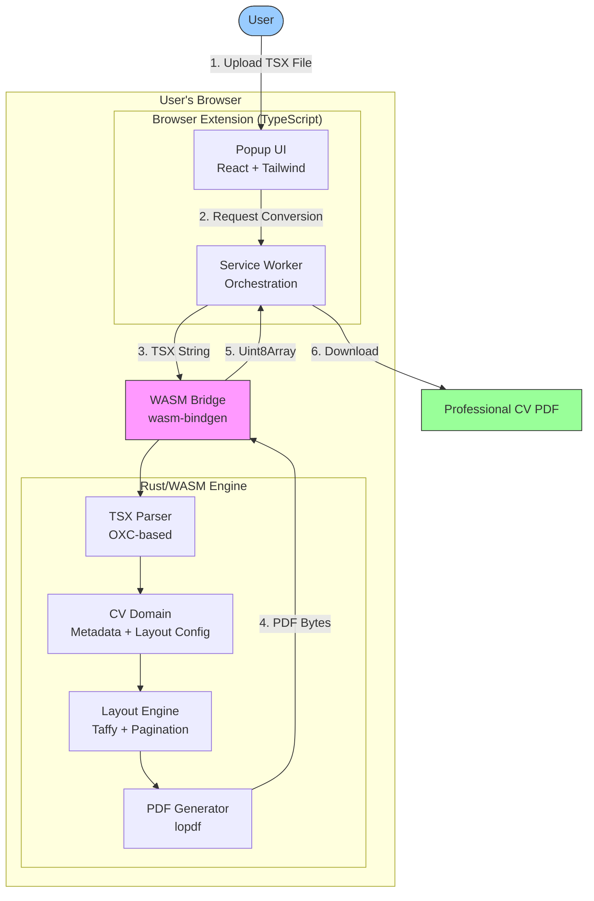

# ResumeWright Architecture

**Version:** 1.0
**Last Updated:** November 2025
**Status:** Beta

---

## Overview

ResumeWright is a privacy-first browser extension that converts Claude.ai-generated CV/resume TSX components into professional, ATS-compatible PDF files. The architecture combines a high-performance **Rust/WebAssembly core engine** with a **TypeScript-based browser extension interface** to deliver seamless, local-only CV conversion directly in your browser.

**Core Principles:**
- **Client-Side Only:** All processing happens locally in the browser (zero data transmission)
- **Performance-First:** Rust/WASM handles CPU-intensive operations (14-25x faster than targets)
- **Privacy-Preserving:** No backend servers, no cloud services, no external data sharing
- **Accessibility-First:** WCAG 2.1 Level A compliance built into core architecture

**Current Status:** Beta - Core features complete, ready for testing and feedback Quality Assurance & Launch (not started)

---

## High-Level Architecture

### Architecture Pattern

**Pipeline Architecture:** Sequential stages (Parse → Extract Metadata → Extract Layout → Calculate Layout → Generate PDF) with clear data flow and error propagation. This pattern:
- Matches the natural document conversion workflow
- Simplifies debugging and testing
- Enables progress reporting at each stage
- Allows recovery from errors at stage boundaries

---

## Technology Stack

### Frontend (Browser Extension)

| Technology | Version | Purpose |
|-----------|---------|---------|
| **TypeScript** | 5.9+ | Extension logic with type safety |
| **React** | 19.2+ | Popup and options UI components |
| **Tailwind CSS** | 3.4+ | Utility-first styling |
| **Zustand** | 5.0+ | Lightweight state management (1.2KB) |
| **WXT** | Latest | Browser extension build tool |
| **Vite** | 7.1+ | Fast bundler with HMR |
| **IndexedDB** | Browser API | Local storage for history/settings |

### Backend (Rust/WASM Core)

| Technology | Version | Purpose |
|-----------|---------|---------|
| **Rust** | 1.91+ | Core engine language (memory-safe, high-performance) |
| **wasm-bindgen** | 0.2+ | JavaScript ↔ Rust interop |
| **oxc_parser** | 0.99+ | TypeScript/JSX parsing (fast, Rust-native) |
| **lopdf** | 0.31+ | PDF document generation |
| **tailwind-css-fixes* | 0.12.31+ | Tailwind CSS class parsing |
| **serde** | 1.0+ | Serialization/deserialization |

### Testing

| Technology | Purpose |
|-----------|---------|
| **Vitest** | TypeScript unit/component tests |
| **cargo test** | Rust unit/integration tests |
| **Playwright** | E2E and visual regression tests |

---

## PDF Generation Pipeline

The conversion process flows through 5 stages:

### Stage 1: Parse TSX (10%)
**Crate:** `tsx-parser`

Parses TSX using OXC (Rust-native TypeScript/JSX parser), validates syntax, builds AST.

### Stage 2: Extract Metadata (20%)
**Crate:** `cv-domain`

Extracts CV elements from AST: name, contact info, experience, education, skills.

### Stage 3: Extract Layout Config (30%)
**Crate:** `cv-domain`

Extracts layout configuration from TSX document structure.

### Stage 4: Calculate Layout (60%)
**Crate:** `layout-engine`

Uses Taffy (CSS Flexbox) for layout calculation, handles text wrapping, pagination, and element positioning.

### Stage 5: Generate PDF (80%)
**Crate:** `pdf-generator`

Creates PDF document with embedded fonts, renders elements, optimizes for ATS compatibility.

---

## Extension Architecture

### Components

The browser extension follows Chrome's Manifest V3 architecture:

**1. Popup UI** (`packages/extension/src/popup/`)
- React-based interface
- File upload for TSX input
- Conversion controls and progress display
- Settings management
- State managed by Zustand

**2. Background Service Worker** (`packages/extension/src/background/`)
- Orchestrates WASM conversions
- Handles state persistence
- Manages downloads API
- Message passing coordinator

**3. Shared Types** (`packages/extension/src/shared/types.ts`)
- TypeScript interfaces for CVDocument, ConversionJob, UserSettings
- Valibot validation schemas
- Error code enums

### Build System

**WXT** (Web Extension Tools) handles extension bundling:
- Hot module reload in development
- Automatic manifest generation
- Chrome/Firefox compatibility
- WASM integration via vite-plugin-wasm

**Monorepo Structure:**
- `pnpm workspaces` for TypeScript packages
- `Cargo workspaces` for Rust crates
- Coordinated builds: Rust → WASM → TypeScript

---

## Performance Characteristics

### Current Performance (High-End Devices)

| Metric | Target | Actual | Status |
|--------|--------|--------|--------|
| Single-page CV | <5s | 1-2s | ✅ 2.5-5x faster |
| Multi-page CV | <10s | 2-4s | ✅ 2.5-5x faster |
| WASM Bundle | <2 MB | 1.43 MB gzipped | ✅ Under limit |
| Layout Time | N/A | 40-136µs | ✅ Excellent |

**E2E Conversion Times:**
- Simple CV: 358ms (25x faster than 10s target)
- Complex CV: 969ms (14x faster than 10s target)

### Low-End Device Targets

| Device Type | Single-Page | Multi-Page |
|------------|------------|-----------|
| High-end (8GB+ RAM) | <5s | <10s |
| Low-end (4GB RAM, Chromebook) | <8s | <15s |

---

## Key Architectural Decisions

### 1. Rust/WASM for Performance
**Decision:** Use Rust compiled to WebAssembly for CPU-intensive operations
**Rationale:** 10x performance improvement over JavaScript, memory safety, excellent WASM tooling

### 2. OXC for TSX Parsing
**Decision:** Use oxc_parser for TypeScript/JSX parsing
**Rationale:** Rust-native (fast), actively maintained, comprehensive TSX support, smaller footprint than SWC

### 3. Client-Side Only Architecture
**Decision:** All processing happens in the browser, no backend servers
**Rationale:** Privacy requirement, zero infrastructure costs, offline capability, simplified deployment

### 4. lopdf for PDF Generation
**Decision:** Use lopdf library for PDF creation
**Rationale:** Pure Rust (no C dependencies), actively maintained, mature library with comprehensive PDF support

### 5. WXT Build System (2025-10)
**Decision:** Migrated from CRXJS to WXT
**Rationale:** Active maintenance, better TypeScript support, improved DX, modern tooling

### 6. File Import Workflow (2025-10)
**Decision:** File import as primary workflow (not DOM detection)
**Rationale:** Claude Artifacts use same-origin iframes (isolated), file import more reliable and universal

---

## Security & Privacy

### Security Measures

- **Content Security Policy (CSP):** Strict CSP for extension pages
- **Permissions:** Minimal permissions requested (storage, downloads)
- **No eval():** No dynamic code execution
- **Input validation:** Valibot schemas validate all user input
- **Dependency scanning:** Regular audits with cargo audit / npm audit

### Privacy Guarantees

- **Zero Data Transmission:** All processing happens locally
- **No Analytics:** No telemetry
- **No Cloud Storage:** Settings stored locally via browser storage API
- **No User Accounts:** Extension requires no authentication
- **Open Source:** Transparent code for auditing

---

## ATS Optimization

Generated PDFs are optimized for Applicant Tracking Systems:

1. **Text Searchability:** All text rendered as actual text (not images)
2. **Font Embedding:** Standard fonts properly embedded
3. **Layout Simplification:** Flattened structures for parsing
4. **Reading Order:** Top-to-bottom, left-to-right order
5. **No Complex Layouts:** Avoid tables, multi-column when possible
