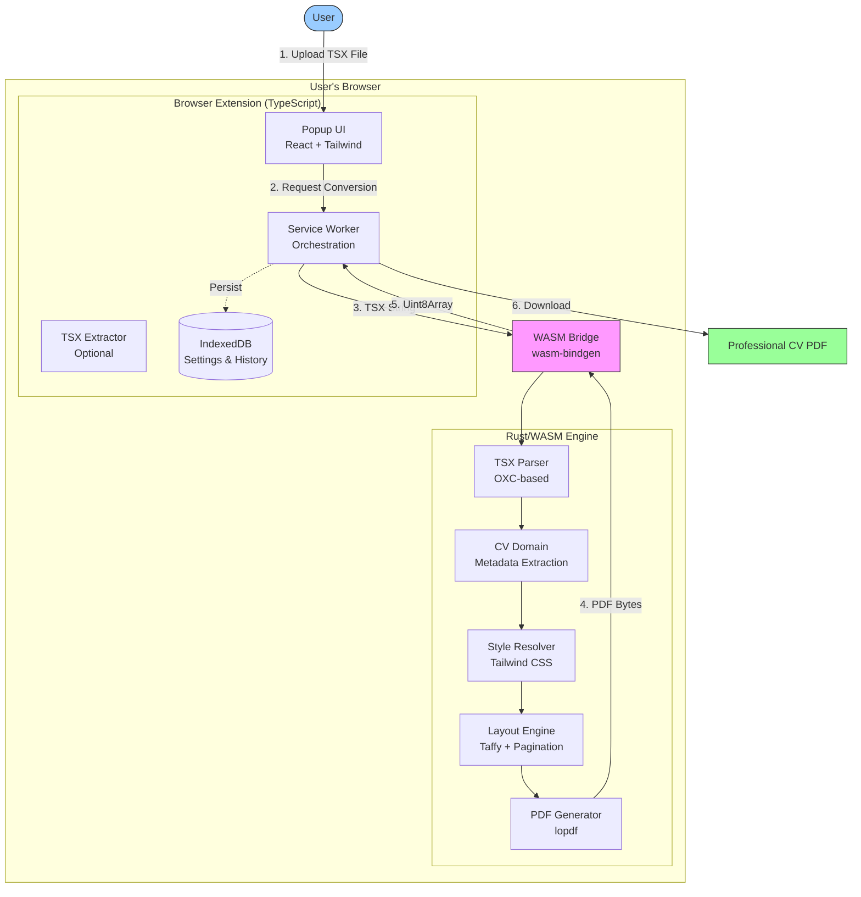

# ResumeWright Architecture

**Version:** 1.0
**Last Updated:** November 2025
**Status:** Beta

---

## Overview

ResumeWright is a privacy-first browser extension that converts Claude.ai-generated CV/resume TSX components into professional, ATS-compatible PDF files. The architecture combines a high-performance **Rust/WebAssembly core engine** with a **TypeScript-based browser extension interface** to deliver seamless, local-only CV conversion directly in your browser.

**Core Principles:**
- **Client-Side Only:** All processing happens locally in the browser (zero data transmission)
- **Performance-First:** Rust/WASM handles CPU-intensive operations (14-25x faster than targets)
- **Privacy-Preserving:** No backend servers, no cloud services, no external data sharing
- **Accessibility-First:** WCAG 2.1 Level A compliance built into core architecture

**Current Status:** Beta - Core features complete, ready for testing and feedback Quality Assurance & Launch (not started)

---

## High-Level Architecture



### Architecture Pattern

**Pipeline Architecture:** Sequential stages (Parse → Extract → Render → Layout → Generate) with clear data flow and error propagation. This pattern:
- Matches the natural document conversion workflow
- Simplifies debugging and testing
- Enables progress reporting at each stage
- Allows recovery from errors at stage boundaries

---

## Technology Stack

### Frontend (Browser Extension)

| Technology | Version | Purpose |
|-----------|---------|---------|
| **TypeScript** | 5.9+ | Extension logic with type safety |
| **React** | 19.2+ | Popup and options UI components |
| **Tailwind CSS** | 3.4+ | Utility-first styling |
| **Zustand** | 5.0+ | Lightweight state management (1.2KB) |
| **WXT** | Latest | Browser extension build tool |
| **Vite** | 7.1+ | Fast bundler with HMR |
| **IndexedDB** | Browser API | Local storage for history/settings |

### Backend (Rust/WASM Core)

| Technology | Version | Purpose |
|-----------|---------|---------|
| **Rust** | 1.91+ | Core engine language (memory-safe, high-performance) |
| **wasm-bindgen** | 0.2+ | JavaScript ↔ Rust interop |
| **oxc_parser** | 0.99+ | TypeScript/JSX parsing (fast, Rust-native) |
| **lopdf** | 0.31+ | PDF document generation |
| **tailwind-css-fixes* | 0.12.31+ | Tailwind CSS class parsing |
| **serde** | 1.0+ | Serialization/deserialization |

### Testing

| Technology | Purpose |
|-----------|---------|
| **Vitest** | TypeScript unit/component tests |
| **cargo test** | Rust unit/integration tests |
| **Playwright** | E2E and visual regression tests |

---

## PDF Generation Pipeline

The conversion process flows through 5 distinct stages:

### Stage 1: TSX Parsing (10%)
**Input:** TSX source code string
**Output:** Abstract Syntax Tree (AST)
**Crate:** `tsx-parser`

Tokenizes and parses JSX syntax using OXC (fast Rust-native TypeScript/JSX parser). Validates syntax and builds AST representation.

### Stage 2: Metadata Extraction (20%)
**Input:** TSX AST
**Output:** CV Metadata (name, contact, sections)
**Crate:** `cv-domain`

Traverses AST to extract CV elements: name, contact info, experience, education, skills. Validates required fields and generates PDF configuration.

### Stage 3: Style Resolution (40%)
**Input:** TSX AST + CV Metadata
**Output:** Styled Layout Elements
**Crate:** `style-resolver`

Resolves Tailwind CSS classes and inline styles, applies CSS inheritance rules, and merges styles into StyleDeclaration structures ready for layout calculation.

### Stage 4: Layout Calculation (60%)
**Input:** Styled Layout Elements + PDF Config
**Output:** Positioned Layout Structure
**Crate:** `layout-engine`

Uses Taffy (CSS Flexbox implementation) to calculate layouts, handles text wrapping with hyphenation support, calculates pagination with intelligent page breaks, and positions elements with absolute coordinates.

### Stage 5: PDF Generation (80%)
**Input:** Positioned Layout Structure
**Output:** PDF bytes (Vec<u8>)
**Crate:** `pdf-generator`

Initializes PDF document, sets metadata, creates pages, renders elements (text with fonts, shapes, colors), optimizes for ATS (text searchability, proper reading order), and compresses/finalizes.

---

## Extension Architecture

### Components

The browser extension follows Chrome's Manifest V3 architecture:

**1. Popup UI** (`packages/extension/src/popup/`)
- React-based interface
- File upload for TSX input
- Conversion controls and progress display
- Settings management
- State managed by Zustand

**2. Background Service Worker** (`packages/extension/src/background/`)
- Orchestrates WASM conversions
- Handles state persistence
- Manages downloads API
- Message passing coordinator

**3. TSX Extractor** (`packages/extension/src/content/`)
- Optional component for future DOM-based detection
- Currently file import workflow is primary

**4. Shared Types** (`packages/extension/src/shared/types.ts`)
- TypeScript interfaces for CVDocument, ConversionJob, UserSettings
- Valibot validation schemas
- Error code enums

### Build System

**WXT** (Web Extension Tools) handles extension bundling:
- Hot module reload in development
- Automatic manifest generation
- Chrome/Firefox compatibility
- WASM integration via vite-plugin-wasm

**Monorepo Structure:**
- `pnpm workspaces` for TypeScript packages
- `Cargo workspaces` for Rust crates
- Coordinated builds: Rust → WASM → TypeScript

---

## Performance Characteristics

### Current Performance (High-End Devices)

| Metric | Target | Actual | Status |
|--------|--------|--------|--------|
| Single-page CV | <5s | 1-2s | ✅ 2.5-5x faster |
| Multi-page CV | <10s | 2-4s | ✅ 2.5-5x faster |
| WASM Bundle | <2 MB | 1.43 MB gzipped | ✅ Under limit |
| Layout Time | N/A | 40-136µs | ✅ Excellent |

**E2E Conversion Times:**
- Simple CV: 358ms (25x faster than 10s target)
- Complex CV: 969ms (14x faster than 10s target)

### Low-End Device Targets

| Device Type | Single-Page | Multi-Page |
|------------|------------|-----------|
| High-end (8GB+ RAM) | <5s | <10s |
| Low-end (4GB RAM, Chromebook) | <8s | <15s |

---

## Testing Strategy

### Test Coverage

**Rust Tests:** Comprehensive test suite
- Unit tests in each crate
- Integration tests across crates
- Doc tests for examples
- Coverage: ~77% (target: 70%) ✅

**TypeScript Tests:** Extensive unit and component testing
- Unit tests (Vitest) in `src/__tests__/`
- Integration tests in `src/__tests__/integration/`
- Component tests (React Testing Library)
- Coverage: ~80% (target: 80%) ✅

**E2E & System Tests:** Multi-layered validation
- E2E tests (Playwright in `tests/e2e/`)
- Visual regression tests (`tests/visual/`)
- Performance benchmarks (`src/__tests__/integration/performance/`)
- Accessibility tests (`tests/accessibility/`)
- ATS compatibility tests (`src/__tests__/integration/ats/`)
- Manual test documentation (`tests/manual/`)

### Quality Metrics

- **P0 Bugs:** 0
- **Code Quality Score:** 92-100/100
- **WCAG 2.1 Level A:** 100% compliance
- **Clippy Warnings:** 0 (Rust linter)
- **ESLint Errors:** 0

---

## Key Architectural Decisions

### 1. Rust/WASM for Performance (ADR-001)
**Decision:** Use Rust compiled to WebAssembly for CPU-intensive operations
**Rationale:** 10x performance improvement over JavaScript, memory safety, excellent WASM tooling

### 2. OXC for TSX Parsing (ADR-002)
**Decision:** Use oxc_parser for TypeScript/JSX parsing
**Rationale:** Rust-native (fast), actively maintained, comprehensive TSX support, smaller footprint than SWC

### 3. Client-Side Only Architecture
**Decision:** All processing happens in the browser, no backend servers
**Rationale:** Privacy requirement, zero infrastructure costs, offline capability, simplified deployment

### 4. lopdf for PDF Generation (ADR-004)
**Decision:** Use lopdf library for PDF creation
**Rationale:** Pure Rust (no C dependencies), actively maintained, mature library with comprehensive PDF support

### 5. WXT Build System (2025-10)
**Decision:** Migrated from CRXJS to WXT
**Rationale:** Active maintenance, better TypeScript support, improved DX, modern tooling

### 6. File Import Workflow (2025-10)
**Decision:** File import as primary workflow (not DOM detection)
**Rationale:** Claude Artifacts use same-origin iframes (isolated), file import more reliable and universal

---

## Data Models

### CVMetadata

```rust
pub struct CVMetadata {
    pub name: Option<String>,
    pub email: Option<String>,
    pub phone: Option<String>,
    pub location: Option<String>,
    pub linkedin: Option<String>,
    pub github: Option<String>,
    pub summary: Option<String>,
    pub experience: Vec<Experience>,
    pub education: Vec<Education>,
    pub skills: Vec<Skill>,
}
```

### ConversionJob

```typescript
interface ConversionJob {
  id: string;
  status: 'idle' | 'parsing' | 'rendering' | 'generating' | 'complete' | 'error';
  progress: number; // 0-100
  tsx: string;
  pdfData?: Uint8Array;
  error?: ConversionError;
  timestamp: number;
}
```

### UserSettings

```typescript
interface UserSettings {
  paperSize: 'A4' | 'Letter';
  margins: { top: number; right: number; bottom: number; left: number };
  fontSize: number;
  lineHeight: number;
  autoDownload: boolean;
}
```

---

## Security & Privacy

### Security Measures

- **Content Security Policy (CSP):** Strict CSP for extension pages
- **Permissions:** Minimal permissions requested (storage, downloads)
- **No eval():** No dynamic code execution
- **Input validation:** Valibot schemas validate all user input
- **Dependency scanning:** Regular audits with cargo audit / npm audit

### Privacy Guarantees

- **Zero Data Transmission:** All processing happens locally
- **No Analytics:** No telemetry in MVP (opt-in post-launch)
- **No Cloud Storage:** Settings/history stored in local IndexedDB only
- **No User Accounts:** Extension requires no authentication
- **Open Source:** Transparent code for auditing

---

## ATS Optimization

Generated PDFs are optimized for Applicant Tracking Systems:

1. **Text Searchability:** All text rendered as actual text (not images)
2. **Font Embedding:** Standard fonts properly embedded
3. **Layout Simplification:** Flattened structures for parsing
4. **Reading Order:** Top-to-bottom, left-to-right order
5. **No Complex Layouts:** Avoid tables, multi-column when possible

---

## Development Workflow

### Setup

```bash
# Install dependencies
pnpm install

# Build WASM
pnpm build:wasm

# Start development server
pnpm dev

# Run tests
pnpm test
```

### Build Commands

```bash
pnpm build:wasm          # Build Rust → WASM (1.43 MB gzipped)
pnpm build               # Full production build
pnpm typecheck           # TypeScript type checking
pnpm test:rust           # Rust tests
pnpm test:ts             # TypeScript tests
pnpm test:e2e            # Playwright E2E tests
pnpm test:visual         # Visual regression tests
pnpm lint                # ESLint
pnpm ci                  # Full CI validation
```

### Loading Extension in Chrome

1. Build: `pnpm build`
2. Open Chrome: `chrome://extensions/`
3. Enable "Developer mode"
4. Click "Load unpacked"
5. Select `dist/` directory

---

## Project Structure

```
resumewright/
├── packages/
│   ├── extension/              # TypeScript extension (WXT-based)
│   │   ├── src/
│   │   │   ├── background/     # Service worker
│   │   │   ├── content/        # TSX extractor (optional)
│   │   │   ├── popup/          # React UI
│   │   │   ├── shared/         # Types and utilities
│   │   │   └── __tests__/      # Unit & integration tests
│   │   │       ├── integration/  # Integration tests
│   │   │       │   ├── performance/  # Performance benchmarks
│   │   │       │   ├── ats/          # ATS compatibility tests
│   │   │       │   └── visual/       # Visual fidelity tests
│   │   │       ├── a11y/        # Accessibility tests
│   │   │       ├── mocks/       # Test mocks
│   │   │       └── utils/       # Test utilities
│   │   ├── tests/              # E2E & system tests (Playwright)
│   │   │   ├── e2e/            # End-to-end tests
│   │   │   ├── visual/         # Visual regression tests
│   │   │   ├── accessibility/  # Accessibility tests
│   │   │   └── manual/         # Manual test docs
│   │   ├── wxt.config.ts       # WXT configuration
│   │   └── package.json
│   └── rust-core/              # Rust/WASM backend (12 crates)
│       ├── tsx-parser/         # OXC-based TSX parsing
│       ├── cv-domain/          # CV metadata extraction
│       ├── style-resolver/     # Tailwind CSS resolution
│       ├── layout-engine/      # Taffy-based layout
│       ├── layout-types/       # Shared layout types
│       ├── pdf-generator/      # PDF creation with lopdf
│       ├── font-toolkit/       # Font embedding
│       ├── wasm-bridge/        # WASM bindings
│       ├── pdf-test-utils/     # Testing utilities
│       ├── pdf-to-png/         # Visual regression
│       ├── pdf-fixture-generator/  # Test fixtures
│       └── regex-utils/        # WASM-compatible regex
├── docs-public/                # Public documentation
├── scripts/                    # Build and utility scripts
├── pkg/                        # Built WASM (gitignored)
├── dist/                       # Extension build (gitignored)
├── Cargo.toml                  # Rust workspace
├── package.json                # pnpm workspace
├── pnpm-workspace.yaml         # Workspace config
└── ARCHITECTURE.md             # This file (symlink)
```

---

## Resources

### Documentation

- **Development Guide:** `DEVELOPMENT.md` 
- **Troubleshooting:** `TROUBLESHOOTING.md`
- **Contributing Guide:** `../CONTRIBUTING.md`
- **Privacy Policy:** `../PRIVACY.md`

### Code

- **GitHub:** https://github.com/vitalratel/resumewright
- **Issues:** https://github.com/vitalratel/resumewright/issues

### Technology References

- **Rust:** https://www.rust-lang.org/
- **WebAssembly:** https://webassembly.org/
- **wasm-bindgen:** https://rustwasm.github.io/wasm-bindgen/
- **React:** https://react.dev/
- **WXT:** https://wxt.dev/
- **Chrome Extensions:** https://developer.chrome.com/docs/extensions/

---

## Contributing

See `CONTRIBUTING.md` for detailed contribution guidelines.

**Quick Start:**
1. Fork the repository
2. Create a feature branch
3. Make your changes (with tests)
4. Run `pnpm ci` (must pass)
5. Submit a pull request

---

## License

MIT License - see [../LICENSE](../LICENSE) for details

---

**Built with privacy and performance in mind.**
