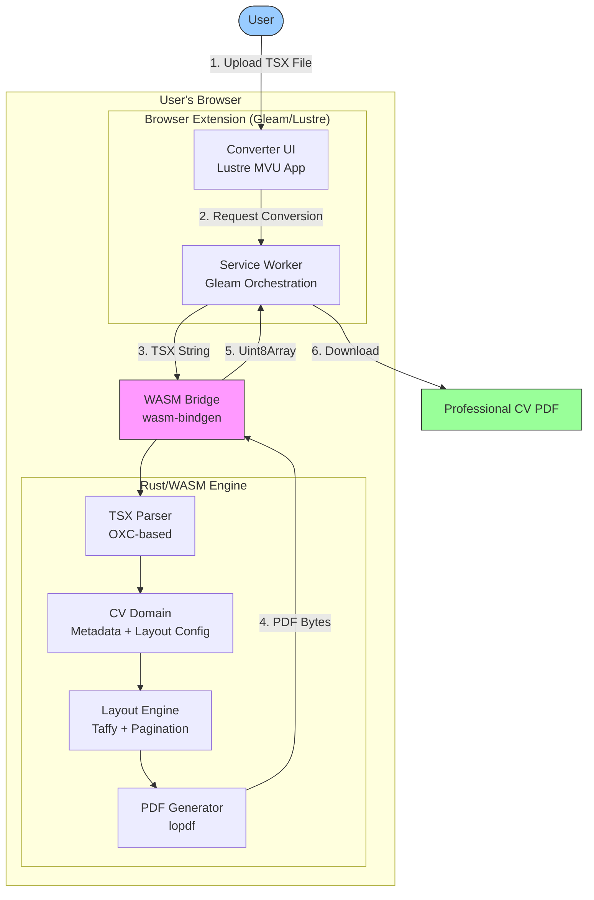

# ResumeWright Architecture

**Version:** 2.0
**Last Updated:** February 2026
**Status:** Beta

---

## Overview

ResumeWright is a privacy-first browser extension that converts Claude.ai-generated CV/resume TSX components into professional, ATS-compatible PDF files. The architecture combines a high-performance **Rust/WebAssembly core engine** with a **Gleam/Lustre browser extension interface** to deliver seamless, local-only CV conversion directly in your browser.

**Core Principles:**
- **Client-Side Only:** All processing happens locally in the browser (zero data transmission)
- **Performance-First:** Rust/WASM handles CPU-intensive operations (14-25x faster than targets)
- **Privacy-Preserving:** No backend servers, no cloud services, no external data sharing
- **Accessibility-First:** WCAG 2.1 Level A compliance built into core architecture

**Current Status:** Beta - Core features complete, ready for testing and feedback

---

## High-Level Architecture


```mermaid
graph TB
    subgraph "User's Browser"
        subgraph "Browser Extension (Gleam/Lustre)"
            UI[Converter UI<br/>Lustre MVU App]
            Background[Service Worker<br/>Gleam Orchestration]
        end

        subgraph "Rust/WASM Engine"
            Parser[TSX Parser<br/>OXC-based]
            CVDomain[CV Domain<br/>Metadata + Layout Config]
            Layout[Layout Engine<br/>Taffy + Pagination]
            PDFGen[PDF Generator<br/>lopdf]
        end

        WASM[WASM Bridge<br/>wasm-bindgen]
    end

    User([User])
    PDF[Professional CV PDF]

    User -->|1. Upload TSX File| UI
    UI -->|2. Request Conversion| Background
    Background -->|3. TSX String| WASM
    WASM --> Parser
    Parser --> CVDomain
    CVDomain --> Layout
    Layout --> PDFGen
    PDFGen -->|4. PDF Bytes| WASM
    WASM -->|5. Uint8Array| Background
    Background -->|6. Download| PDF

    style WASM fill:#f9f,stroke:#333
    style User fill:#9cf,stroke:#333
    style PDF fill:#9f9,stroke:#333
```

### Architecture Pattern

**Pipeline Architecture:** Sequential stages (Parse → Extract Metadata → Extract Layout → Calculate Layout → Generate PDF) with clear data flow and error propagation. This pattern:
- Matches the natural document conversion workflow
- Simplifies debugging and testing
- Enables progress reporting at each stage
- Allows recovery from errors at stage boundaries

---

## Technology Stack

### Frontend (Browser Extension)

| Technology | Version | Purpose |
|-----------|---------|---------|
| **Gleam** | 1.14+ | Statically-typed functional language for extension UI and service worker |
| **Lustre** | 5.6+ | Elm-inspired MVU framework for UI (Model-View-Update) |
| **Tailwind CSS** | 4.0+ | Utility-first styling |
| **plinth** | 0.9+ | Gleam bindings for browser APIs (File, FileReader, Blob, drag-drop) |
| **gleam_json** | 3.1+ | JSON encoding/decoding for Chrome storage and message passing |

### Backend (Rust/WASM Core)

| Technology | Version | Purpose |
|-----------|---------|---------|
| **Rust** | 1.91+ | Core engine language (memory-safe, high-performance) |
| **wasm-bindgen** | 0.2+ | JavaScript ↔ Rust interop |
| **oxc_parser** | 0.99+ | TypeScript/JSX parsing (fast, Rust-native) |
| **lopdf** | 0.31+ | PDF document generation |
| **serde** | 1.0+ | Serialization/deserialization |

### Testing

| Technology | Purpose |
|-----------|---------|
| **gleam test** | Gleam unit tests |
| **cargo test** | Rust unit/integration tests |
| **Playwright** | E2E and visual regression tests |
| **axe-core** | WCAG 2.1 Level A/AA accessibility auditing |

---

## PDF Generation Pipeline

The conversion process flows through 5 stages:

### Stage 1: Parse TSX (10%)
**Crate:** `tsx-parser`

Parses TSX using OXC (Rust-native TypeScript/JSX parser), validates syntax, builds AST.

### Stage 2: Extract Metadata (20%)
**Crate:** `cv-domain`

Extracts CV elements from AST: name, contact info, experience, education, skills.

### Stage 3: Extract Layout Config (30%)
**Crate:** `cv-domain`

Extracts layout configuration from TSX document structure.

### Stage 4: Calculate Layout (60%)
**Crate:** `layout-engine`

Uses Taffy (CSS Flexbox) for layout calculation, handles text wrapping, pagination, and element positioning.

### Stage 5: Generate PDF (80%)
**Crate:** `pdf-generator`

Creates PDF document with embedded fonts, renders elements, optimizes for ATS compatibility.

---

## Extension Architecture

### MVU Pattern (Model-View-Update)

The Gleam frontend uses Lustre's MVU pattern — the same architecture as Elm:

- **Model:** Immutable application state (`src/app/model.gleam`)
- **View:** Pure function from Model → HTML (`src/app/view.gleam` + `src/view/`)
- **Update:** Pure function from (Model, Msg) → (Model, Effect) (`src/app/update.gleam`)

All state transitions are explicit message types (`src/app/msg.gleam`), making the data flow easy to trace and test.

### Components

The browser extension follows Chrome's Manifest V3 architecture:

**1. Converter UI** (`packages/app_gleam/src/`)
- Gleam/Lustre application mounting to `<div id="app">`
- File drag-and-drop import with TSX validation
- Conversion controls and progress display
- Settings management (page size, margins, theme)
- MVU state machine: Importing → Converting → Success/Error

**2. Background Service Worker** (`packages/app_gleam/src/background/`)
- Gleam-compiled service worker (separate bundle)
- Orchestrates WASM conversions
- Handles Chrome downloads API
- Message passing coordinator with typed messages

**3. Chrome FFI Layer** (`packages/app_gleam/src/ffi/`)
- `chrome_ffi.mjs` — thin JS wrappers for Chrome extension APIs
- `background_ffi.mjs` — WASM bridge callers (init, TsxToPdfConverter, extract_cv_metadata)
- plinth covers File/FileReader/Blob/DataTransfer natively

**4. Shared Types** (`packages/app_gleam/src/shared/`)
- `types.gleam` — PageSize, Margin, ConversionConfig, Theme, Settings, ConversionStatus, ConversionProgress, ConversionError
- `codecs.gleam` — JSON decoders/encoders for Chrome storage (camelCase) and message passing
- `validation.gleam` — Pure validation functions for margins, settings, conversion config

### Build System

**lustre_dev_tools** handles the Gleam frontend bundle:
- Compiles `packages/app_gleam/` → `packages/extension/public/gleam/app_gleam.js`
- esbuild-based, no WXT or Vite for application code
- Static `manifest.json` replaces generated manifests

**Build command:**
```bash
pnpm build:gleam   # gleam run -m lustre/dev build app_gleam
pnpm build:wasm    # wasm-pack build packages/rust-core/wasm-bridge
pnpm build         # full production build (wasm + gleam + CSS)
```

**Monorepo Structure:**
- `pnpm workspaces` for JS/Gleam packages
- `Cargo workspaces` for Rust crates
- Coordinated builds: Rust → WASM → Gleam → Extension

---

## Performance Characteristics

### Current Performance (High-End Devices)

| Metric | Target | Actual | Status |
|--------|--------|--------|--------|
| Single-page CV | <5s | 1-2s | ✅ 2.5-5x faster |
| Multi-page CV | <10s | 2-4s | ✅ 2.5-5x faster |
| WASM Bundle | <2 MB | 1.43 MB gzipped | ✅ Under limit |
| Layout Time | N/A | 40-136µs | ✅ Excellent |

**E2E Conversion Times:**
- Simple CV: 358ms (25x faster than 10s target)
- Complex CV: 969ms (14x faster than 10s target)

### Low-End Device Targets

| Device Type | Single-Page | Multi-Page |
|------------|------------|-----------|
| High-end (8GB+ RAM) | <5s | <10s |
| Low-end (4GB RAM, Chromebook) | <8s | <15s |

---

## Key Architectural Decisions

### 1. Rust/WASM for Performance
**Decision:** Use Rust compiled to WebAssembly for CPU-intensive operations
**Rationale:** 10x performance improvement over JavaScript, memory safety, excellent WASM tooling

### 2. OXC for TSX Parsing
**Decision:** Use oxc_parser for TypeScript/JSX parsing
**Rationale:** Rust-native (fast), actively maintained, comprehensive TSX support, smaller footprint than SWC

### 3. Client-Side Only Architecture
**Decision:** All processing happens in the browser, no backend servers
**Rationale:** Privacy requirement, zero infrastructure costs, offline capability, simplified deployment

### 4. lopdf for PDF Generation
**Decision:** Use lopdf library for PDF creation
**Rationale:** Pure Rust (no C dependencies), actively maintained, mature library with comprehensive PDF support

### 5. Gleam/Lustre for Extension UI
**Decision:** Migrated from vanilla TypeScript to Gleam/Lustre
**Rationale:** Type-safe functional language with exhaustive pattern matching, MVU architecture makes state transitions explicit and testable, eliminates runtime null/undefined errors

### 6. File Import Workflow
**Decision:** File import as primary workflow (not DOM detection)
**Rationale:** Claude Artifacts use same-origin iframes (isolated), file import more reliable and universal

### 7. Static Manifest + lustre_dev_tools Build
**Decision:** Replaced WXT with static manifest.json + lustre_dev_tools (esbuild)
**Rationale:** WXT's Vite integration doesn't compose with Gleam's build pipeline; lustre_dev_tools provides a leaner, Gleam-native build path

---

## Security & Privacy

### Security Measures

- **Content Security Policy (CSP):** Strict CSP for extension pages (`style-src 'self'`)
- **Permissions:** Minimal permissions requested (storage, downloads)
- **No eval():** No dynamic code execution
- **Input validation:** Gleam type system + validation module validate all user input
- **Dependency scanning:** Regular audits with cargo audit / pnpm audit

### Privacy Guarantees

- **Zero Data Transmission:** All processing happens locally
- **No Analytics:** No telemetry
- **No Cloud Storage:** Settings stored locally via Chrome storage sync API
- **No User Accounts:** Extension requires no authentication
- **Open Source:** Transparent code for auditing

---

## ATS Optimization

Generated PDFs are optimized for Applicant Tracking Systems:

1. **Text Searchability:** All text rendered as actual text (not images)
2. **Font Embedding:** Standard fonts properly embedded
3. **Layout Simplification:** Flattened structures for parsing
4. **Reading Order:** Top-to-bottom, left-to-right order
5. **No Complex Layouts:** Avoid tables, multi-column when possible
